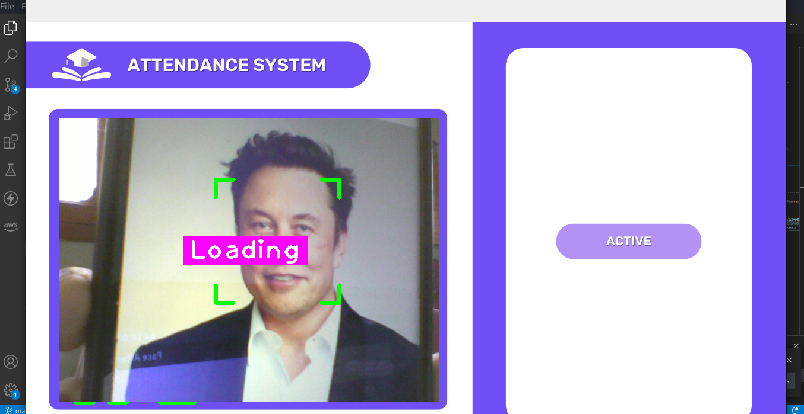

# Face Detection Attendance System

This project utilizes face detection and recognition to mark attendance for students. It captures the webcam feed, recognizes faces, and displays student details along with attendance information.

## Installation

To run the project, make sure you have the following libraries installed:

1. cmake
2. dlib
3. face-recognition
4. cvzone
5. opencv

You can install these libraries using the package manager of your choice or by running the following command:

## Usage

1. Run the `main.py` file.
2. The webcam feed will be displayed, and the program will start recognizing faces.
3. When a recognized student is detected, the "Marked" window will be displayed, indicating successful recognition.
4. The program will then fetch the student's details from the Firebase database and display them along with attendance information.
5. After a certain period, the program will switch back to the default attendance window.

## Screenshots

### Active window

### Attendence window

## Contributing

Contributions are welcome! If you encounter any issues or have suggestions for improvements, feel free to open an issue or submit a pull request.
